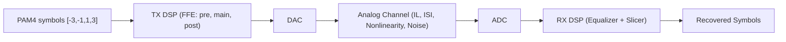

<p align="center">
  
</p>

<h1 align="center">Kattis IMC Challenge</h1>

<p align="center">
  Code, notes, and visuals for the <a href="https://www.huawei.com/minisite/imc-challenge/en/">Huawei IMC Challenge</a> —
  high‑speed signal modeling and equalization on real PAM4 links.
</p>

<p align="center">
  <a href="https://www.python.org/"></a>
  <a href="#"></a>
  <a href="#"></a>
</p>

---

## Table of contents

- [About](#about)
- [At a glance](#at-a-glance)
- [Repository layout](#repository-layout)
- [Quickstart](#quickstart)
- [Problem A — Signal modeling](#problem-a--signal-modeling)
- [Problem B — Equalization to PAM4](#problem-b--equalization-to-pam4)
- [Results dashboard](#results-dashboard)
- [Figures to complete](#figures-to-complete)
- [Roadmap](#roadmap)
- [References](#references)

---

## About

The International Microelectronics Challenge (IMC) focuses on recovering information sent over
band‑limited, noisy, and potentially nonlinear high‑speed channels. This repository contains my
solutions, exploratory notebooks, and figure templates to document the approach.

- **Problem A**: learn a forward model that maps PAM4 symbols to an analog waveform and reconstruct
  a clean signal at oversample rate **OSR=16** with output length **L = K × 16**.
- **Problem B**: equalize an oversampled waveform (**OSR=4**) and slice it back to PAM4 levels
  \[-3, -1, 1, 3\].

> PDFs with the official statements live under `docs/`.

---

## At a glance

<div align="center">

| Problem | Input | Output | Objective |
|:--|:--|:--|:--|
| **A — Modeling** | Analog waveform + reference symbols | Reconstructed analog waveform (`L = K × 16`) | Minimize RMSE vs. hidden reference |
| **B — Equalization** | Analog waveform (OSR=4) | PAM4 sequence \[-3, -1, 1, 3\] of length `N/4` | Minimize BER |

</div>

### System context



---

## Repository layout

```text
.
├── data/                       # Waveforms and sliced data (add .txt/.npy here)
├── docs/
│   ├── imc-problem-a.pdf       # Official statement (Problem A)
│   ├── imc-problem-b.pdf       # Official statement (Problem B)
│   └── figs/                   # All figures for the README / report
│       ├── imc-logo.png
│       ├── problemA_overview.png
│       ├── problemB_eye_diagram.png
│       ├── channel_impulse_response.png
│       ├── ffe_3tap_block.png
│       ├── eq_convergence.png
│       └── confusion_matrix_pbB.png
├── problem_A/
│   ├── proposed_solution_pb_A.py
│   └── README.md               # (optional) per‑module notes
├── problem_B/
│   ├── proposed_solution_pb_B.py
│   └── README.md               # (optional) per‑module notes
├── runs/                       # Outputs, logs, metrics
├── requirements.txt
└── README.md
```

> Tip: keep large raw files out of Git with `data/` in `.gitignore`, and track metadata in `runs/`.

---

## Quickstart

Create an environment and install dependencies:

```bash
python -m venv .venv && source .venv/bin/activate
pip install -r requirements.txt
```

Minimal runs (replace paths with your files):

```bash
# Problem A — forward modeling / waveform reconstruction
python problem_A/proposed_solution_pb_A.py \
  --analog data/ana_waveform1.txt \
  --symbols data/dig_data1.txt \
  --out runs/pbA_recon_waveform.npy

# Problem B — equalization + slicing to PAM4
python problem_B/proposed_solution_pb_B.py \
  --analog data/ana_waveform_pbB.txt \
  --out runs/pbB_symbols.txt
```

Suggested `requirements.txt` (edit as needed):

```
numpy
scipy
matplotlib
pandas
numba
```

---

## Problem A — Signal modeling

**Task.** Learn a differentiable (or piecewise) forward model `f` that maps known PAM4 symbols to
their analog waveform; apply the learned `f` to new symbols to produce `L = K × 16` samples and
minimize RMSE.

**Approach (baseline).**

- **Pre‑analysis:** stats per slice (mean, RMS, zero‑crossings) + UI alignment heuristics.
- **Front‑end TX model:** 3‑tap FFE (pre, main, post) + DAC hold (optional).
- **Channel:** short FIR (ISI) + soft nonlinearity (e.g., tanh / 3rd‑order Volterra lite).
- **Fit:** least squares / ridge on FIR taps; grid search small NL; early‑stop on RMSE.
- **Validation:** overlay reconstructed vs. reference; eye and residual plots.

**CLI ideas.**

```bash
python problem_A/proposed_solution_pb_A.py \
  --analog data/ana_waveform1.txt \
  --symbols data/dig_data1.txt \
  --osr 16 \
  --model ffe3+fir8+tanh \
  --save-fig docs/figs/problemA_overview.png
```

**Figures you can drop in now:**

- `docs/figs/ffe_3tap_block.png` — block diagram of the TX 3‑tap FFE.
- `docs/figs/channel_impulse_response.png` — estimated channel/FIR taps.
- `docs/figs/problemA_overview.png` — overlay of reconstructed vs ground‑truth waveform.

---

## Problem B — Equalization to PAM4

**Task.** Given an analog waveform at **OSR=4**, equalize and slice to yield one symbol per UI with
values in \[-3, -1, 1, 3\]; output length must be `N/4`.

**Approach (baseline).**

- **Sync:** estimate UI timing (4 samples/UI) via autocorr / spectral peak; lock phase.
- **Linear EQ:** LMMSE/DFE or LMS‑trained FIR (7–21 taps), optionally with decision‑directed update.
- **Slicer:** adaptive thresholds or k‑means init on eye levels; optional hysteresis.
- **Post‑proc:** run‑length sanity checks, tiny‑ISI deglitch, confidence scores.

**CLI ideas.**

```bash
python problem_B/proposed_solution_pb_B.py \
  --analog data/ana_waveform_pbB.txt \
  --osr 4 \
  --eq lmmse --eq-taps 15 \
  --slice adaptive \
  --save-fig docs/figs/problemB_eye_diagram.png
```

**Figures you can drop in now:**

- `docs/figs/problemB_eye_diagram.png` — eye diagram with slicer thresholds.
- `docs/figs/eq_convergence.png` — training loss / MSE vs iterations.
- `docs/figs/confusion_matrix_pbB.png` — confusion matrix on a labeled slice.

---

## Results dashboard

<div align="center">

| Metric | Value |
|:--|---:|
| **Score** | 1234 |
| **Position** | 42 |

</div>

You can extend this with per‑problem tables (RMSE for A, BER for B) and a small changelog of
what improved each week.

---

## Figures to complete

Place your .png/.svg under `docs/figs/` using these filenames so the README renders nicely:

- `imc-logo.png` (repo header)
- `ffe_3tap_block.png` (Problem A — TX DSP)
- `channel_impulse_response.png` (Problem A — estimated channel)
- `problemA_overview.png` (Problem A — overlay of true vs reconstructed waveform)
- `problemB_eye_diagram.png` (Problem B — eye with thresholds)
- `eq_convergence.png` (Problem B — equalizer training curve)
- `confusion_matrix_pbB.png` (Problem B — confusion matrix)

---

## Roadmap

- [ ] Clean CLI args + config files (YAML) for reproducible runs
- [ ] Add `runs/` auto‑naming convention with metrics JSON
- [ ] Unit tests for UI sync, EQ, and slicer
- [ ] Lightweight notebook(s) for EDA and figs
- [ ] Optional: CUDA‑accelerated FIR/LMS with `numba` or `cupy`

---

## References

- Official statements: see [`docs/imc-problem-a.pdf`](docs/imc-problem-a.pdf) and
  [`docs/imc-problem-b.pdf`](docs/imc-problem-b.pdf).
- Background on PAM4 equalization, LMS/LMMSE, decision feedback equalizers, and eye diagrams.
- DACs/ADCs, channel ISI/IL/nonlinearity, and TX FFE/RX EQ design basics.
